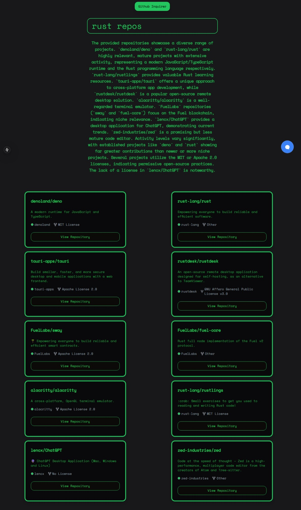

<h1 align="center">🍢 github_inquirer 🍢</h1>
<h2 align="center">AI-powered GitHub repository search transformer</h2>

<p align="center">
    
</p>

> [!NOTE]  
> **github_inquirer** is an AI-driven tool for querying GitHub repositories. It uses the Gemini Flash AI to structure search queries and display repository results on a sleek frontend built with Next.js and Tailwind CSS. The backend is powered by LangGraph Agent, communicating seamlessly with the frontend through CopilotKit agents.

## 🌟 Features

> **github_inquirer** features:

- **AI-Powered GitHub Search** – Leverage Gemini Flash AI to generate advanced search queries for GitHub repositories.
- **Next.js & Tailwind Frontend** – A modern, responsive interface with a clean and user-friendly design.
- **LangGraph Agent Backend** – The backend architecture that powers complex data fetching and search query logic.
- **Seamless Integration with CopilotKit** – Connect the frontend and backend efficiently for real-time updates and interaction.


## 🔪 Installation & Running

> You can add **github_inquirer** with one command via:

###### terminal

You can run the provided `run.sh` script to install and start both the agent and the UI automatically:

### Steps:

1. Clone the repository:
   ```bash
   git clone https://github.com/ArnavK-09/github_inquirer.git
   cd github_inquirer
   ```

2. Run the setup script:
   ```bash
   ./run.sh
   ```

   This script will:
   - Navigate to the `agent` directory and run the Poetry agent in the background.
   - Start the Next.js development server for the frontend.

   Or, if you prefer manual steps:

### Manual Steps:

1. **Run the backend (LangGraph Agent):**
   - Navigate to the `agent` directory:
     ```bash
     cd agent
     ```
   - Run the Poetry agent:
     ```bash
     poetry run agent &
     ```

2. **Run the frontend (Next.js with Tailwind CSS):**
   - Return to the root directory:
     ```bash
     cd ..
     ```
   - Navigate to the `gui` directory:
     ```bash
     cd gui
     ```
   - Start the development server:
     ```bash
     npm run dev
     ```


## 📷 Screenshots

> Here's a working and expected screenshot of github_inquirer


| Whole Website  |
|------------|
|  |

## 📹 Video Demo


https://github.com/user-attachments/assets/24ea75b2-fd50-41ae-9bf0-2b7f08759d5d


---

## 💻 Contributing

> [!TIP]  
> We welcome contributions to improve **github_inquirer**! If you have suggestions, bug fixes, or new feature ideas, follow these steps:

1. **Fork the Repository**  
   Click the **Fork** button at the top-right of the repo page.

2. **Clone Your Fork**  
   Clone the repo locally:

   ```bash
   git clone https://github.com/ArnavK-09/github_inquirer.git
   ```

3. **Create a Branch**  
   Create a new branch for your changes:

   ```bash
   git checkout -b your-feature-branch
   ```

4. **Make Changes**  
   Implement your changes (bug fixes, features, etc.).

5. **Commit and Push**  
   Commit your changes and push the branch:

   ```bash
   git commit -m "feat(scope): description"
   git push origin your-feature-branch
   ```

6. **Open a Pull Request**  
   Open a PR with a detailed description of your changes.

7. **Collaborate and Merge**  
   The maintainers will review your PR, request changes if needed, and merge it once approved.

## 🙋‍♂️ Issues

Found a bug or need help? Please create an issue on the [GitHub repository](https://github.com/ArnavK-09/github_inquirer/issues) with a detailed description.

## 👤 Author

<table>
  <tbody>
    <tr>
        <td align="center" valign="top" width="14.28%"><a href="https://github.com/ArnavK-09"></a><br /><a href="https://github.com/ArnavK-09"<h4><b>Arnav K</b></h3></a></td>
    </tr>
  </tbody>
</table>

---

<h2 align="center">📄 License</h2>

<p align="center">
<strong>github_inquirer</strong> is licensed under the <code>Unlicense</code> License. See the <a href="https://github.com/ArnavK-09/github_inquirer/blob/main/LICENSE">LICENSE</a> file for more details.
</p>

---

<p align="center">
    <strong>🌟 If you find this project helpful, please give it a star on GitHub! 🌟</strong>
</p>
